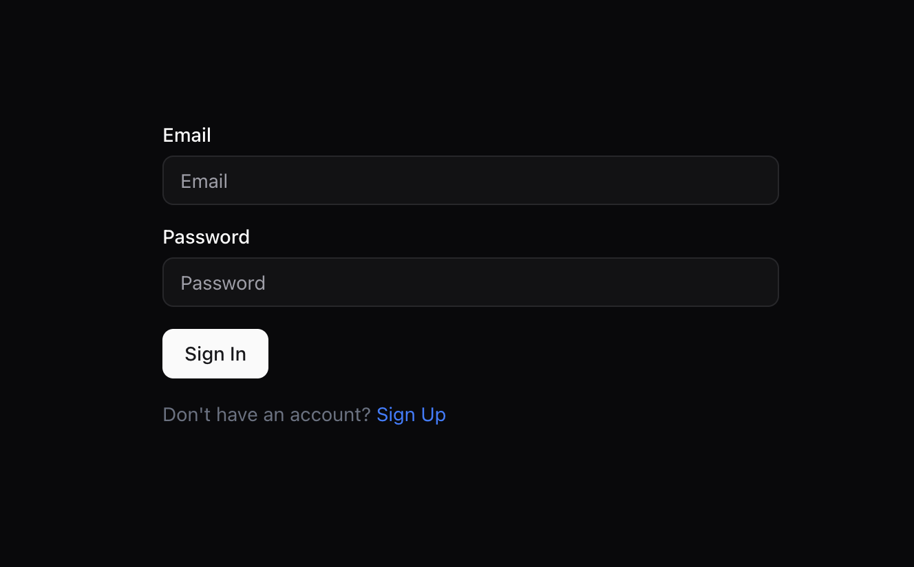

<p align="center">
  
</p>

🔐 Complete Authentication System with React & SuperTokens

🚀 Welcome to the Complete Authentication System — a ready-to-use, secure, and scalable solution for user authentication built with React (frontend) and SuperTokens (backend).
It’s fast, customizable, and production-ready.

⸻

✨ Features

	🔒 Secure Authentication – Robust session management powered by SuperTokens.
	⚡ Modern Frontend – Built with React, Vite, and TailwindCSS.
	📡 Scalable Backend – Node.js + Express for flexible authentication logic.
	🔄 Session Management – Automatic refresh token handling.
	🛠️ Customizable – Add social logins, MFA, or custom flows easily.

⸻

🖥️ Demo

 


⸻

📂 Project Structure

🖥️ Client

Frontend application built with React & Vite.
Handles UI and communicates with backend for authentication.

- **Path**: [`client`](./client)
- **Tech Stack**: React, Vite, TailwindCSS
- **Setup**:
  ```bash
  cd client
  npm install
  npm run dev

⸻

⚙️ Server

Backend application built with Node.js & Express.
Manages authentication logic, sessions, and SuperTokens integration.

- **Path**: [`server`](./server)
- **Tech Stack**: Node.js, Express, SuperTokens
- **Setup**:
  ```bash
  cd server
  npm install
  npm start
  ``` 

⸻

- **Environment Variables**: Ensure to set up the necessary environment variables for SuperTokens and database connections.
- **Database**: The server uses a database to store user information and session data. Configure your database connection in the `.env` file.
- **API Endpoints**: The server exposes RESTful API endpoints for user registration, login, and session management.
- **Testing**: Use tools like Postman or cURL to test the API endpoints.
- **Deployment**: The server can be deployed on platforms like Heroku, AWS, or any other Node.js hosting service.
- **Environment Variables**: Ensure to set up the necessary environment variables for SuperTokens and database connections.

⸻

🛠️ Technologies (Client Side)


⸻

🛠️ Technologies (Server Side)


⸻

🎯 Summary

This project provides a ready-to-use authentication system with secure session handling, modern frontend, and scalable backend.
Perfect as a starter for any React + Node.js app requiring secure user login.